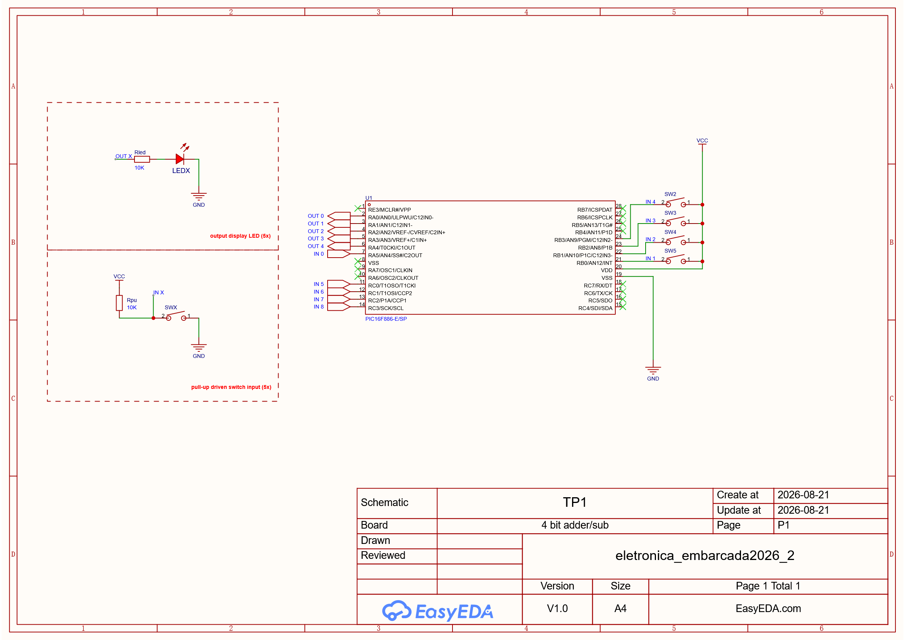

# Test Point 1

Microcontrolador: PIC16F886

## Objetivo

Criar um software que realize a operação de adição entre dois operandos de 4 bits, localizados como entradas nos nibbles menos significativos das portas B (pull-up interno ativado) e C do microcontrolador, e apresentar o resultado nos 5 bits menos significativos da porta A do microcontrolador.

A presença de carry e overflow nas operações é desconsiderada.

## Esquemático das Entradas e Saídas

 
